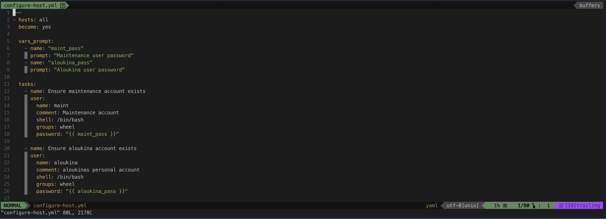

# vim-setup
My personal vim setup. 



**Includes:**
- NerdTree
- AutoClose
- Indent Guides
- Airline + Themes + Icons
- Gruvbox Theme
- Spacegray Theme

Sets tab, and shiftstop to 4 spaces. By default the theme that will be used is "spacegray".

## Requirements

- Ansible 2.4+
- Ansible-playbook

## Install

The install is prepared via an Ansible playbook for easy install. If you are unable to use Ansible, you can install VimPlug by hand, and copy my vimrc file from the `files` directory in this repository to ~/.vimrc. Then you will just need to run `:PlugInstall` inside Vim.

```bash
$ git clone https://github.com/anthonyloukinas/vim-setup.git

$ cd vim-setup

$ ansible-playbook main.yml
```